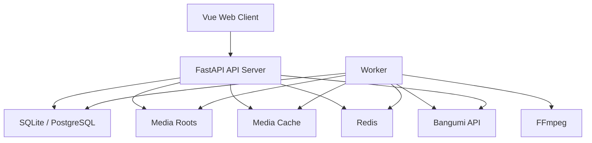
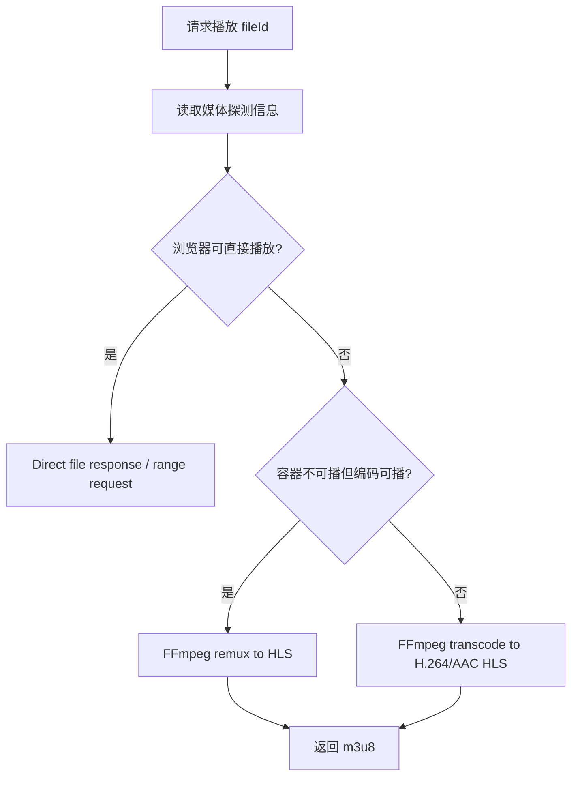

# Euphonium Complete 设计方案

本文档描述 Euphonium Complete 版的产品范围、架构设计、与 Lite 版的异同、可复用代码、需要重构的部分、核心技术难点和分阶段落地路线。本文以当前 Lite 实现和 `docs/README-TECHNICAL.md` 为基础，不把历史规划中尚未落地的内容当作既有能力。

## 1. 定位与目标

Euphonium Lite 是本地单机、纯前端、浏览器授权目录模型。Euphonium Complete 应该定位为自托管媒体库服务器：

- 由服务端长期持有媒体目录访问权，而不是依赖浏览器目录句柄。
- 由服务端扫描、解析、匹配、转码、缓存、备份和执行长任务。
- 前端成为远程 Web 客户端，可以在局域网、内网穿透或反代后访问。
- 数据主存储从浏览器 IndexedDB 转移到服务端数据库。
- 播放能力从浏览器原生 `<video>` 扩展到 FFmpeg/HLS 转封装和必要转码。
- Lite 数据可以迁移到 Complete，但 Complete 不反向依赖 Lite 的浏览器能力。

Complete 的核心目标不是“给 Lite 加一个后端代理”，而是建立一个完整的服务端媒体系统，同时尽量复用 Lite 已验证的领域模型、解析逻辑、审核交互、馆藏 UI 和笔记工作流。

## 2. 产品范围

### 2.1 必做能力

- 服务端媒体根目录配置和扫描。
- 新增、移动、缺失、重复文件识别。
- 正片与附加视频识别，支持 OP/ED/PV/特典/特别篇等非正片视频归入作品但不计入观看进度。
- 文件名解析、目录绑定、Bangumi 候选匹配和人工审核。
- 服务端数据库保存动画、剧集、文件、匹配、合集、笔记、附件、播放进度和任务状态。
- 局域网/远程 Web UI 浏览馆藏。
- 原文件直出、HLS 转封装、必要时转码到浏览器可播格式。
- 字幕发现、外挂字幕加载、内封字幕提取。
- 后台任务队列：扫描、元数据刷新、转码缓存、缩略图生成、字幕提取、可选超分。
- Lite JSON 导入和服务端路径重映射。
- Docker Compose 部署。

### 2.2 非首期能力

- 多用户权限细粒度 ACL。
- 公网账号体系和 OAuth。
- 云端同步服务。
- 移动端原生 App。
- 实时多人协作笔记。
- 自动下载媒体资源。

这些能力可以在架构上预留，但不应进入 Complete MVP 的关键路径。

## 3. Lite 与 Complete 的异同

| 维度     | Lite                                   | Complete                                           |
| -------- | -------------------------------------- | -------------------------------------------------- |
| 运行形态 | 纯前端 SPA                             | Web 前端 + 服务端 API + 后台 worker                |
| 文件访问 | File System Access API，浏览器授权目录 | 服务端挂载路径，长期文件系统访问                   |
| 主存储   | IndexedDB + localStorage               | SQLite/PostgreSQL + 文件系统缓存                   |
| 播放     | `<video>` 直接播放浏览器支持格式       | 原文件直出 + FFmpeg HLS 转封装/转码                |
| 扫描     | 浏览器递归目录，受权限和 API 限制      | 服务端扫描，支持定时/增量/后台任务                 |
| 匹配     | 前端调用 Bangumi API                   | 服务端调用 Bangumi API，集中缓存、限流、User-Agent |
| 笔记附件 | IndexedDB Blob                         | 服务端对象文件或数据库元数据 + 文件存储            |
| 远程访问 | 不支持                                 | 支持局域网/反代/内网穿透                           |
| 多设备   | 依赖同一浏览器数据                     | 天然支持多设备访问同一服务                         |
| 数据备份 | JSON，附件 Blob 未完整导出             | 数据库备份 + 媒体路径配置 + 附件文件备份           |
| 部署     | `pnpm run dev/build`                   | Docker Compose 或本机服务                          |
| 复杂任务 | 不处理                                 | 队列处理转码、缩略图、超分等长任务                 |

## 4. 可复用与需改造部分

### 4.1 可直接复用

- Vue 3 + TypeScript + Vite 前端基础。
- 当前路由和页面信息架构：首页、导入/审核、放映厅、笔记、设置。
- `src/utils/fileNameParser.ts` 的解析规则和类型思路。
- Bangumi 类型定义和字段归一化经验。
- `Anime`、`Episode`、`VideoFile`、`MatchRecord`、`Note`、`Collection` 的领域概念。
- 首页筛选、排序、收藏、回收站、自定义合集的交互。
- 导入审核页的候选选择、手动匹配、集数偏移、单文件修正。
- 导入审核页的附加视频标签编辑。
- 放映厅的剧集列表、附加视频列表、播放进度、倍速、音量、字幕、笔记入口。
- 笔记页的搜索、排序、软删除/恢复/彻底删除交互。
- JSON 导出 schema 的基础思路。

### 4.2 需要抽象后复用

当前 Lite 的 service 直接操作 Dexie 或浏览器 API。Complete 需要把这些能力抽象为“端口 + 适配器”：

```text
Domain Service
  ├─ Lite Adapter: IndexedDB / FileSystemHandle / ObjectURL
  └─ Complete Adapter: HTTP API / server file id / HLS URL
```

建议抽象接口：

```ts
interface LibraryRepository {
  listAnime(query: AnimeQuery): Promise<AnimeListResult>
  getAnime(id: string): Promise<AnimeDetail>
  updateAnime(id: string, changes: AnimePatch): Promise<void>
}

interface ImportRepository {
  listRoots(): Promise<LibraryRoot[]>
  startScan(rootId: string): Promise<JobRef>
  listMatchGroups(sessionId?: string): Promise<MatchGroup[]>
  updateMapping(groupId: string, patch: MatchGroupPatch): Promise<void>
  commitGroup(groupId: string): Promise<void>
}

interface PlaybackRepository {
  getPlaybackSource(fileId: string, options: PlaybackOptions): Promise<PlaybackSource>
  saveProgress(episodeId: string, progress: ProgressPatch): Promise<void>
}
```

这样前端页面可以最大化复用，但底层数据来源在 Lite 和 Complete 之间切换。

### 4.3 需要重写

- `src/services/fileSystem.ts`：Complete 不使用浏览器目录授权，改为服务端根目录 API。
- `src/services/storage.ts`：Complete 不直接读写 Dexie，改为 API client。
- `src/services/playback.ts`：Complete 不通过 Object URL 读取 File，改为 HLS/直链播放源。
- `src/services/exportData.ts`：Complete 导入导出应由服务端完成，前端只负责上传/下载。
- `src/services/bangumi.ts`：Complete 应迁到服务端，便于集中缓存、限流和设置 User-Agent。
- IndexedDB schema：Complete 中仅可作为离线缓存，不能作为主数据源。

### 4.4 不建议复用

- File System Access API 的权限恢复逻辑。
- 浏览器端目录句柄持久化逻辑。
- IndexedDB 事务边界处理。
- `localStorage` 里的筛选缓存作为事实数据。

这些是 Lite 的环境约束，不应带入服务端架构。

## 5. 推荐总体架构



### 5.1 前端

- 继续使用 Vue 3 + TypeScript + Vite。
- 新增 API client 层替代直接 Dexie service。
- 播放器集成 `hls.js`，优先播放 HLS，浏览器原生支持 HLS 的环境可降级直接设置 `src`。
- 保留 Lite 的页面布局和交互，但导入页从“选择浏览器目录”改成“管理服务端媒体根目录 + 启动扫描任务”。

### 5.2 后端 API

推荐 FastAPI：

- Python 生态便于调用 FFmpeg、处理路径、未来集成 Real-CUGAN/waifu2x/PyTorch。
- Pydantic 适合定义请求/响应 DTO。
- OpenAPI 可直接生成前端类型或 API client。

核心 API 模块：

```text
server/app/
  api/
    anime.py
    episodes.py
    files.py
    roots.py
    import_review.py
    playback.py
    notes.py
    collections.py
    jobs.py
    settings.py
    backup.py
  domain/
    parser.py
    matcher.py
    scanner.py
    playback_planner.py
    metadata.py
    transcode.py
  infra/
    db.py
    filesystem.py
    bangumi_client.py
    ffmpeg.py
    queue.py
    cache.py
```

### 5.3 数据库

Complete MVP 建议默认 SQLite，保留 PostgreSQL 支持：

- 单用户自托管场景 SQLite 足够，部署简单。
- 多用户、高并发、复杂队列场景可切 PostgreSQL。
- ORM 使用 SQLAlchemy，迁移使用 Alembic。

### 5.4 任务队列

建议两级设计：

- MVP：Redis + RQ 或 Arq，任务模型简单，部署轻。
- 完整版：Celery + Redis，适合复杂重试、任务路由、GPU 队列和定时任务。

任务类型：

- `scan_root`
- `refresh_metadata`
- `probe_media`
- `generate_thumbnail`
- `extract_subtitles`
- `prepare_hls`
- `transcode_variant`
- `super_resolution`
- `backup_export`
- `lite_import`

### 5.5 文件与缓存目录

服务端应区分媒体源目录和派生缓存目录：

```text
/media/anime/                 用户挂载的原始媒体目录，只读优先
/config/euphonium/config.yml  服务配置
/data/euphonium/app.db        SQLite 数据库
/data/euphonium/attachments/  笔记附件
/cache/euphonium/hls/         HLS 分片和 m3u8
/cache/euphonium/thumbs/      缩略图和预览图
/cache/euphonium/subtitles/   提取/转换后的字幕
/cache/euphonium/jobs/        临时任务产物
```

缓存可以清理，数据库和附件不可随意删除。

## 6. Complete 核心数据模型

Complete 的数据模型应继承 Lite 的领域概念，但字段命名需要服务端化，避免浏览器专属字段。

### 6.1 MediaRoot

```ts
interface MediaRoot {
  id: string
  name: string
  path: string
  enabled: boolean
  scanMode: 'manual' | 'scheduled'
  schedule?: string
  createdAt: string
  updatedAt: string
  lastScannedAt?: string
}
```

### 6.2 MediaFile

```ts
interface MediaFile {
  id: string
  rootId: string
  relativePath: string
  fileName: string
  parentPath: string
  extension: string
  size: number
  modifiedAt: string
  inode?: string
  quickHash: string
  fullHash?: string
  videoCodec?: string
  audioCodec?: string
  container?: string
  durationSeconds?: number
  width?: number
  height?: number
  scanState: 'active' | 'missing' | 'ignored'
  mediaKind: 'episode' | 'extra'
  extraLabel?: string
  extraGroupPath?: string
  animeId?: string
  episodeId?: string
  createdAt: string
  updatedAt: string
}
```

### 6.3 Anime / Episode

```ts
interface Anime {
  id: string
  bangumiId?: number
  title: string
  titleCn?: string
  aliases: string[]
  coverUrl?: string
  summary?: string
  airDate?: string
  airYear?: number
  totalEpisodes?: number
  bangumiScore?: number
  userRating: number
  status: 'watching' | 'planned' | 'completed' | 'on_hold' | 'dropped'
  isFavorite: boolean
  tags: string[]
  source: 'bangumi' | 'manual'
  deletedAt?: string
  createdAt: string
  updatedAt: string
}

interface Episode {
  id: string
  animeId: string
  bangumiEpisodeId?: number
  ep: number
  sort?: number
  type: 0 | 1 | 2 | 3 | 4 | 5 | 6
  title?: string
  titleCn?: string
  airdate?: string
  durationSeconds?: number
  fileIds: string[]
  watched: boolean
  watchedAt?: string
  rating: number
  progressSeconds?: number
  progressPercent?: number
  lastFileId?: string
  createdAt: string
  updatedAt: string
}
```

### 6.4 MatchSession / MatchGroup

```ts
interface MatchSession {
  id: string
  rootId: string
  jobId: string
  status: 'scanning' | 'matching' | 'reviewing' | 'committed' | 'failed'
  scanned: number
  added: number
  updated: number
  missing: number
  createdAt: string
  updatedAt: string
}

interface MatchGroup {
  id: string
  sessionId: string
  folderKey: string
  folderName: string
  parentPath: string
  keyword: string
  status: 'idle' | 'selected' | 'mapped' | 'skipped' | 'committed'
  candidateBangumiIds: number[]
  selectedBangumiId?: number
  selectedAnimeId?: string
  draftMappings: DraftEpisodeMapping[]
  extraFileIds: string[]
  warnings: string[]
  createdAt: string
  updatedAt: string
}
```

### 6.5 PlaybackAsset

```ts
interface PlaybackAsset {
  id: string
  fileId: string
  kind: 'direct' | 'hls-remux' | 'hls-transcode'
  status: 'missing' | 'pending' | 'ready' | 'failed'
  url?: string
  videoCodec?: string
  audioCodec?: string
  container?: string
  profile?: string
  generatedAt?: string
  expiresAt?: string
  error?: string
}
```

### 6.6 Job

```ts
interface Job {
  id: string
  type: string
  status: 'queued' | 'running' | 'succeeded' | 'failed' | 'cancelled'
  progress: number
  message?: string
  payload: Record<string, unknown>
  result?: Record<string, unknown>
  createdAt: string
  startedAt?: string
  finishedAt?: string
}
```

## 7. API 设计草案

### 7.1 媒体根目录

```http
GET    /api/roots
POST   /api/roots
PATCH  /api/roots/{rootId}
DELETE /api/roots/{rootId}
POST   /api/roots/{rootId}/scan
```

### 7.2 导入审核

```http
GET   /api/import/sessions
GET   /api/import/sessions/{sessionId}/groups
PATCH /api/import/groups/{groupId}
POST  /api/import/groups/{groupId}/manual-search
POST  /api/import/groups/{groupId}/commit
POST  /api/import/sessions/{sessionId}/commit-all
POST  /api/import/groups/{groupId}/skip
```

### 7.3 馆藏

```http
GET    /api/anime
GET    /api/anime/{animeId}
PATCH  /api/anime/{animeId}
POST   /api/anime/{animeId}/trash
POST   /api/anime/{animeId}/restore
GET    /api/anime/{animeId}/episodes
PATCH  /api/episodes/{episodeId}
```

### 7.4 播放

```http
GET  /api/playback/episodes/{episodeId}/sources
POST /api/playback/files/{fileId}/prepare
GET  /api/playback/assets/{assetId}/master.m3u8
GET  /api/playback/direct/{fileId}
POST /api/playback/episodes/{episodeId}/progress
```

返回播放源示例：

```json
{
  "mode": "hls",
  "url": "/api/playback/assets/asset-1/master.m3u8",
  "mimeType": "application/vnd.apple.mpegurl",
  "fileId": "file-1",
  "requiresHlsJs": true
}
```

### 7.5 笔记与附件

```http
GET    /api/notes
POST   /api/notes
PATCH  /api/notes/{noteId}
POST   /api/notes/{noteId}/trash
POST   /api/notes/{noteId}/restore
DELETE /api/notes/{noteId}
POST   /api/attachments
GET    /api/attachments/{attachmentId}
```

### 7.6 任务

```http
GET  /api/jobs
GET  /api/jobs/{jobId}
POST /api/jobs/{jobId}/cancel
GET  /api/jobs/events
```

`/api/jobs/events` 可用 Server-Sent Events 推送任务进度，前端不需要频繁轮询。

## 8. 扫描与匹配设计

Complete 扫描应比 Lite 更强：

- 服务端可以使用 `os.scandir` 或异步线程池扫描大量目录。
- 文件身份优先使用平台可用的 inode/device 信息，跨平台兜底 `size + mtime + quickHash`。
- 首次扫描计算 quickHash；深度校验或冲突时再计算 fullHash。
- 使用 FFprobe 提取媒体技术信息：容器、视频编码、音频编码、分辨率、时长、字幕流。
- 内封字幕可登记为 `SubtitleTrack`，需要播放时再提取。

匹配策略沿用 Lite 的“目录分组 + 人工审核”：

1. `rootId + parentPath` 生成 folderKey。
2. 识别 OP/ED/PV/特典/特别篇等附加视频，挂入父目录的 `extraFileIds`，不参与正片集数映射。
3. 已有目录绑定则复用 animeId。
4. 没有绑定则解析文件名和文件夹名生成关键词。
5. 服务端调用 Bangumi 搜索并缓存候选。
6. 根据标题相似度、年份、集数数量、评分给候选排序。
7. 生成草稿映射。
8. 用户审核后写入正式馆藏。

Complete 可以新增“后台自动低风险提交”：

- 目录名与 Bangumi 候选完全匹配。
- 年份一致。
- 本地集数与官方正片集数接近。
- 每个文件都能高置信解析集数。

即便支持自动提交，也必须提供回滚和审核日志。

## 9. 播放与转码设计

### 9.1 播放决策



### 9.2 Direct 播放

对 MP4/WebM 等浏览器可播文件，服务端支持 Range Request：

- 前端可以快进。
- 不需要提前切片。
- 权限检查后才返回文件流。

### 9.3 HLS 转封装

适合 MKV 容器但编码浏览器可支持的场景：

```sh
ffmpeg -i input.mkv -map 0:v:0 -map 0:a:0 -c copy -f hls output.m3u8
```

优势是 CPU 压力小，速度快。风险是某些编码、时间戳、字幕或音轨组合仍可能不兼容。

### 9.4 HLS 转码

当视频编码为 H.265/10bit/AV1 或音频编码浏览器不支持时，需要转码：

```sh
ffmpeg -i input.mkv -map 0:v:0 -map 0:a:0 -c:v libx264 -preset veryfast -crf 21 -c:a aac -f hls output.m3u8
```

可选硬件加速：

- NVIDIA：NVENC。
- Intel：QSV。
- AMD：VAAPI/AMF。

硬件加速必须做能力探测，不能在配置中默认假设存在 GPU。

### 9.5 转码缓存策略

- 按 `fileId + profile + file modified/hash` 生成缓存 key。
- 原文件变化后缓存失效。
- 缓存可设置最大容量和 LRU 清理。
- 正在播放时不能清理对应 HLS 分片。
- 失败任务记录错误，避免短时间反复重试。

### 9.6 字幕策略

- 外挂 `.srt`、`.vtt`、`.ass` 按同名和目录规则自动关联。
- SRT 转 WebVTT 后给浏览器原生字幕轨。
- ASS 可首期转为 VTT，样式损失可接受；后续可前端集成 SubtitlesOctopus。
- 内封字幕由 FFprobe 识别，用户选择时用 FFmpeg 提取到缓存目录。

## 10. 超分与画质增强

Complete 可分两个层级：

### 10.1 实时前端增强

- 前端播放器集成 Anime4K/WebGL 类滤镜。
- 不生成新文件，实时作用于播放画面。
- 适合作为首期“画质增强”功能，因为部署成本低。

### 10.2 离线超分任务

- Worker 调用 Real-CUGAN、waifu2x 或其他模型。
- 输入原始文件或转码中间帧。
- 输出新的视频变体或图片帧序列后再封装。
- GPU 任务必须独立队列，避免阻塞普通扫描和转码。

风险：

- 耗时极长。
- 显存和驱动依赖复杂。
- Docker GPU 穿透配置高。
- 输出文件体积极大。

建议 Complete MVP 不做离线超分，只保留任务模型和 UI 入口规划。

## 11. Lite 数据迁移到 Complete

### 11.1 导入内容

Lite JSON 可迁移：

- Anime
- Episode
- VideoFile 元数据
- MatchRecord
- Collection
- Note
- Attachment manifest

不能直接迁移：

- 浏览器 `FileSystemDirectoryHandle`。
- 浏览器 Object URL。
- 未导出的附件 Blob。

### 11.2 路径重映射

Complete 导入 Lite JSON 后，需要用户选择服务端媒体根目录，并建立路径重映射：

```text
Lite root name: Anime
Lite relative path: 葬送的芙莉莲/01.mkv
Complete root path: /media/anime
Resolved file: /media/anime/葬送的芙莉莲/01.mkv
```

匹配优先级：

1. 相对路径完全命中。
2. 文件名 + size + quickHash 命中。
3. 文件名 + size 命中。
4. 进入人工重映射列表。

### 11.3 ID 策略

建议保留 Lite 的 UUID：

- 迁移时减少笔记、合集、播放进度引用重写。
- Complete 新建数据也使用 UUID。
- Bangumi ID 继续作为外部唯一候选，不作为本地主键。

## 12. 安全与部署

### 12.1 基础安全

- 默认只监听 `127.0.0.1`，局域网访问需要显式配置。
- 如果开启远程访问，必须启用账号密码或反代鉴权。
- 所有媒体文件访问都通过 fileId，不暴露任意路径读取 API。
- root path 配置必须做路径归一化和目录边界校验。
- 禁止通过 API 读取媒体根目录之外的文件。
- 上传备份和附件需要大小限制。

### 12.2 Docker Compose

推荐服务：

```yaml
services:
  web:
    image: euphonium/complete-web
  api:
    image: euphonium/complete-api
    volumes:
      - ./data:/data/euphonium
      - ./cache:/cache/euphonium
      - /your/anime:/media/anime:ro
  redis:
    image: redis:7
  worker:
    image: euphonium/complete-api
    command: worker
    volumes:
      - ./data:/data/euphonium
      - ./cache:/cache/euphonium
      - /your/anime:/media/anime:ro
```

MVP 可以把 web 静态资源由 API 服务托管，减少一个容器。拆分 web 容器适合后续 CDN 或独立部署。

### 12.3 GPU 支持

GPU 支持应该是可选 profile：

- 默认 compose 不要求 GPU。
- NVIDIA 用户启用额外 compose 文件。
- 服务启动时检测 FFmpeg 编码器和模型运行环境。
- UI 中展示“硬件加速可用/不可用”的诊断结果。

## 13. 前端改造方案

建议演进为 monorepo 结构：

```text
apps/
  web/                 Vue 前端，复用当前 src/ui
  server/              FastAPI 后端
packages/
  domain/              共享 TypeScript 类型、DTO、常量
  parser/              可共享的文件名解析器
  client/              OpenAPI 生成或手写 API client
```

当前仓库如果继续作为 Lite 仓库，可以先做最小侵入：

```text
src/services/
  adapters/
    lite/
    complete/
  repositories/
    libraryRepository.ts
    importRepository.ts
    playbackRepository.ts
```

页面层不直接 import `storage.ts`、`fileSystem.ts`、`playback.ts`，而是 import repository。这样同一套 UI 可以在 Lite 和 Complete 之间复用。

## 14. 服务端技术难点

### 14.1 文件扫描规模

大量目录扫描会遇到 IO 峰值、权限错误、符号链接循环、文件正在写入等问题。

处理：

- 限制扫描并发。
- 跳过隐藏目录、临时文件和配置中的 ignore pattern。
- 检测 symlink，默认不跟随或限制在 root 内。
- 文件大小和 mtime 稳定后再计算 hash。
- 扫描过程可取消，可恢复，可记录错误明细。

### 14.2 HLS 实时生成延迟

首次播放如果等待完整转码，会体验很差。

处理：

- 转封装优先，能 copy codec 就不转码。
- 生成首批分片后即可返回播放 URL。
- 后台继续生成后续分片。
- 对热门/最近播放剧集预生成。

### 14.3 多播放请求竞争

多个客户端同时请求同一文件，不能启动多个相同转码任务。

处理：

- 用缓存 key 加数据库唯一约束或 Redis lock。
- 已有 pending/running 任务时复用同一个 asset。
- 前端订阅任务进度，ready 后自动开始播放。

### 14.4 字幕和音轨选择

动画文件常见多音轨、多字幕、ASS 样式字幕。

处理：

- FFprobe 保存 track 元数据。
- 播放源请求允许传 `audioTrackId` 和 `subtitleTrackId`。
- VTT/SRT 原生输出。
- ASS 首期转 VTT，后续增加 ASS 渲染方案。

### 14.5 Bangumi API 稳定性

服务端集中调用 API 后，失败会影响整个库刷新。

处理：

- 请求限流和重试。
- API cache 持久化。
- 每个 match group 独立失败，不中断整个扫描。
- 支持手动输入 Bangumi ID 和手动条目。

### 14.6 数据迁移和 schema 演进

Complete 一旦持有服务端数据库，迁移必须严肃处理。

处理：

- Alembic 管理 schema。
- 导入导出带 schema version。
- 后端提供 dry-run 导入。
- 大迁移前自动生成数据库备份。

### 14.7 远程访问安全

媒体服务器一旦暴露到公网，就可能变成任意文件读取风险。

处理：

- API 不接受任意路径，只接受 rootId/fileId。
- 服务端每次解析路径都验证仍在 root path 内。
- 默认关闭公网访问。
- 反代部署文档明确鉴权要求。

## 15. 分阶段实施路线

### 阶段 0：为 Complete 做 Lite 端解耦

- 抽象 repository 接口。
- 将页面从 Dexie/browser service 直接依赖中解耦。
- 将领域类型集中到可共享目录。
- 为 parser 增加单元测试。

验收：Lite 功能不变，但数据访问可以替换为另一套 adapter。

### 阶段 1：Complete 后端 MVP

- FastAPI 项目骨架。
- SQLite + SQLAlchemy + Alembic。
- MediaRoot 配置。
- 服务端扫描和 `MediaFile` 入库。
- Bangumi search/subject/episodes 缓存。
- MatchSession/MatchGroup 审核 API。
- 前端通过 API 完成扫描审核和馆藏浏览。

验收：不依赖浏览器目录授权，服务端能扫库并生成馆藏。

### 阶段 2：播放 MVP

- Direct file response with Range。
- FFprobe 媒体探测。
- HLS remux。
- HLS.js 前端播放。
- 播放进度保存。
- 字幕文件发现和 SRT/VTT 输出。

验收：常见 MP4 直播，MKV 至少能通过 remux 播放；不兼容编码给出明确转码任务。

### 阶段 3：转码与缓存

- H.264/AAC HLS 转码 profile。
- 任务队列和进度推送。
- 转码缓存管理。
- 硬件加速探测和可选配置。
- 缩略图和预览图生成。

验收：H.265/MKV 可以通过转码播放，多个客户端复用同一缓存。

### 阶段 4：数据迁移与备份

- Lite JSON 导入。
- 路径重映射 UI。
- 附件完整备份方案。
- 服务端数据库和附件备份。

验收：Lite 已有馆藏和笔记可迁移到 Complete，并能重新关联服务端文件。

### 阶段 5：高级能力

- 多用户基础权限。
- Anime4K 前端实时增强。
- 离线超分任务。
- 多元数据源。
- 移动端适配或 PWA。

## 16. 关键决策建议

1. Complete 使用服务端数据库作为唯一事实源，浏览器 IndexedDB 只做缓存或 Lite 专属存储。
2. 前端 UI 尽量复用，但数据访问必须通过 repository/API client 抽象。
3. Complete MVP 先做“服务端扫描 + 审核 + 直播/remux”，不要一开始就做离线超分。
4. 转码系统必须有任务队列、缓存 key、并发锁和失败状态，不能在请求线程里同步跑完整 FFmpeg。
5. Lite 到 Complete 的迁移以 UUID 和相对路径为核心，不能依赖浏览器目录句柄。
6. 安全模型必须从第一天设计好：API 只读 fileId，不读任意路径。
7. 历史规划里的 TipTap、Zip、超分都可以继续作为方向，但 Complete 首期应优先解决服务端媒体库和播放格式边界。

## 17. 与当前 Lite 代码的直接关系

短期可以在当前仓库新增设计和抽象，不必马上建立后端。建议下一步技术任务：

- 把 `src/models` 整理为稳定领域类型，并补充 DTO 类型。
- 给 `src/utils/fileNameParser.ts` 增加测试样例。
- 抽象 `LibraryRepository`、`ImportRepository`、`PlaybackRepository`。
- 保留 Lite adapter，新增 Complete API adapter 的空实现。
- 导入页和放映厅逐步改为依赖 repository，而不是直接依赖 browser/Dexie service。

完成这些后，Complete 后端可以并行开发，前端不需要大规模重写。
