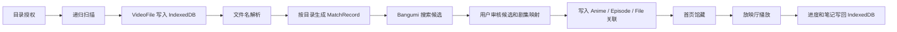

# Euphonium Lite 需求与架构设计

本文档面向开发和维护者，描述 Euphonium Lite 当前已经实现的需求范围、架构设计、核心数据流、技术难点及处理方式。历史方案请参考 `docs/euphonium.md`、`docs/euphonium-V2.md` 和 `docs/euphonium-V3.md`，本文件以当前代码为准。

## 1. 项目目标

Euphonium Lite 是一个纯前端、本地优先的动画媒体库工具，目标是在没有后端服务的前提下完成单机媒体库管理闭环：

1. 用户授权本地动画目录。
2. 应用递归扫描视频文件，提取文件元数据并生成稳定身份。
3. 按目录聚合文件，自动搜索 Bangumi 动画候选。
4. 用户审核动画候选和剧集映射。
5. 确认后写入浏览器本地 IndexedDB。
6. 用户在首页、放映厅和笔记页完成浏览、播放、记录和备份。

Lite 版不处理服务端转码、远程访问、多设备同步、HLS 分发、超分任务或完整附件包导出。

## 2. 需求分析

### 2.1 用户需求

- 管理本地动画文件，但不希望文件上传到远程服务器。
- 从杂乱的字幕组文件名中自动识别作品名、季度和集数。
- 自动获取 Bangumi 元数据，同时保留人工确认入口。
- 支持文件名解析错误后的手动修正，例如重新匹配、单集修正和批量偏移。
- 将确认后的动画形成可搜索、可筛选、可排序的本地馆藏。
- 能从馆藏直接进入播放页面，继续上次观看进度。
- 能围绕动画和单集写笔记，记录时间戳和截图。
- 能导出 JSON 备份，便于迁移或重建浏览器数据。

### 2.2 功能范围

已实现范围：

- 本地目录授权和递归扫描。
- 视频文件过滤、采样哈希、重复文件跳过、移动/缺失状态更新。
- 文件名解析和解析详情测试。
- Bangumi v0 搜索、详情和剧集接口调用。
- 导入审核页：候选选择、手动重新匹配、剧集映射、批量偏移、重置解析、一键确认、一键取消。
- 首页：封面墙、搜索、年份/标签筛选、排序、最近、收藏、回收站、自定义合集。
- 放映厅：本地文件播放、文件源选择、播放进度、倍速、音量、全屏、字幕、评分、收藏、笔记。
- 笔记页：动画维度聚合、搜索、排序、Markdown 风格编辑/预览、软删除、恢复、彻底删除。
- 设置页：主题、精简模式、解析测试、JSON 导入导出、清空 IndexedDB。

明确不在当前范围：

- 后端媒体库服务。
- 服务端转码和浏览器不可播格式转封装。
- 远程播放和跨设备同步。
- 自动下载字幕或刮削多个元数据源。
- Zip 备份附件 Blob。

## 3. 技术架构

### 3.1 分层结构

```text
src/router/            路由定义
src/ui/                页面、组件、样式、轻量 UI 状态
src/services/          业务服务：扫描、匹配、写库、播放、笔记、备份
src/db/                Dexie 数据库定义和 IndexedDB 迁移
src/models/            领域模型类型
src/utils/             文件名解析等纯工具
```

应用通过 Vue Router 组织页面：

- `/`：馆藏首页。
- `/import`：目录扫描与匹配审核。
- `/notes`：笔记工作台。
- `/settings`：设置与数据管理。
- `/theatre/:id`：放映厅。

UI 状态使用 `src/ui/stores/uiState.ts` 中的 Vue `reactive` 对象维护，没有引入全局 Pinia store。跨会话 UI 设置使用 `localStorage` 持久化。

### 3.2 核心数据流



关键设计点：

- 扫描和匹配分离：扫描只负责文件事实，匹配负责候选和审核状态。
- 审核先落库：待确认的 `MatchRecord` 存在 IndexedDB 中，页面刷新后可以恢复审核进度。
- 写库分两阶段：`dataWriter` 先在事务外获取 Bangumi 详情和计算变更，再在事务内批量写入本地实体，避免长事务包住网络请求。

## 4. 数据模型与存储

### 4.1 主库 `EuphoniumLite`

由 `src/db/db.ts` 定义，当前主版本为 3。

- `libraryRoots`：用户授权的媒体根目录，保存 `FileSystemDirectoryHandle`、名称、授权时间和扫描时间。
- `dirHandle`：历史兼容目录句柄表，放映厅在主记录缺失时仍会尝试读取。
- `anime`：本地动画馆藏，包含 Bangumi ID、标题、封面、简介、标签、评分、收藏、删除状态和播放状态。
- `episodes`：剧集信息，包含 Bangumi 剧集 ID、集数、标题、关联文件、观看进度和评分。
- `files`：扫描到的视频文件，包含根目录、相对路径、父目录、大小、修改时间、采样哈希和扫描状态。
- `match`：导入审核记录，包含目录 key、搜索词、候选 Bangumi ID、选择结果、草稿剧集映射、警告和状态。
- `collections`：用户自定义合集，保存合集名称、动画 ID 列表和排序。
- `watchHistory`：历史 schema 保留表，当前业务代码不读写；保留它是为了避免破坏已有 IndexedDB 迁移路径。

### 4.2 笔记库 `EuphoniumLiteNotes`

由 `src/services/notes.ts` 定义。

- `notes`：笔记正文、纯文本、目标类型、目标 ID、附件 ID、创建/更新时间和软删除时间。
- `attachments`：附件 Blob、名称、MIME、大小、所属笔记和创建时间。

### 4.3 本地配置

- `euphonium-ui-settings`：主题、精简模式、解析规则输入。
- `euphonium-nav-order`：内置导航与自定义合集顺序。
- `euphonium-library-filter-options`：从已导入动画中记忆的年份和标签筛选项。

## 5. 扫描设计

扫描入口是 `src/services/fileSystem.ts`。

流程：

1. `requestLibraryRoot` 调用 `window.showDirectoryPicker()` 请求目录授权。
2. 授权句柄写入 `libraryRoots` 和兼容用的 `dirHandle`。
3. `scanDirectory` 使用异步目录迭代递归读取文件。
4. 只保留 `.mp4`、`.mkv`、`.avi`、`.mov`、`.wmv`、`.flv`、`.webm`。
5. `computeQuickHash` 对文件头部、三分之一、三分之二和尾部采样，合并后计算 SHA-256。
6. 用 `size + quickHash` 判定文件身份，用路径辅助识别移动或更新。
7. 本轮未见到的旧文件标记为 `missing`，不直接删除。

难点与处理：

- 大文件全量哈希成本高：采用采样哈希，牺牲极低概率碰撞风险换取扫描速度。
- 文件移动不能只靠路径判断：优先用 `size + quickHash` 找回已有记录，再更新相对路径。
- 浏览器授权可能失效：播放和扫描前都会检查权限，必要时请求重新授权。

## 6. 文件名解析

解析逻辑位于 `src/utils/fileNameParser.ts`。

支持的主要模式：

- `S01E01`、`Season 1 Episode 1`。
- `EP01`、`Episode 01`。
- `第 1 话`、`第 1 集`、中文数字集数。
- `01-02` 集数范围。
- 普通尾部数字集数。
- 字幕组、分辨率、编码、音轨、来源、字幕语言、版本和特殊篇标签识别。

解析结果包含：

- 标题、季度、集数和集数范围。
- 标题候选列表。
- 置信度和警告。
- 字幕组、分辨率、视频编码、音频编码、片源、字幕语言、额外标签。

技术难点：

- 动画标题本身可能包含数字，例如《十二国记》。当前通过黑名单避免把特定标题数字误判为集数。
- 技术标签和集数都可能出现在括号里。解析先识别技术 span，再从标题候选中剔除。
- 普通数字集数的误判风险最高，因此置信度低于显式 `SxxEyy` 和 `EPxx`。

当前限制：

- 设置页的自定义正则会持久化并可测试，但导入扫描链路仍使用内置解析器。

## 7. Bangumi 匹配与写库

### 7.1 候选搜索

`src/services/bangumi.ts` 调用 Bangumi v0 API：

- `POST /v0/search/subjects?limit=4`：搜索动画候选，固定 `type: [2]`。
- `GET /v0/episodes?subject_id=...`：获取剧集。
- `GET /v0/subjects/:id`：获取条目详情。

搜索结果在运行期用 `Map` 做关键词缓存，避免同一轮重复请求。

### 7.2 匹配记录生命周期

`MatchRecord.status` 当前使用：

- `idle`：待确认或可重新匹配。
- `mapping`：已被导入确认流程领取，正在写库。
- `completed`：写入完成。

导入页支持：

- 手动输入关键词重新搜索。
- 选择候选动画。
- 单文件改集数。
- 批量偏移。
- 重置为文件名解析结果。
- 删除待处理目录。

### 7.3 写库策略

`src/services/dataWriter.ts` 负责把确认结果写入本地馆藏：

- 如果本地已有相同 Bangumi ID 的动画，则复用现有 `anime.id`。
- 否则创建新的 `Anime`。
- Bangumi 主线剧集按 `type === 0` 过滤。
- 剧集优先用 `bangumi_episode_id` 对齐，缺失时用 `sort` 或 `ep` 兜底。
- 文件写回 `ep_id` 和 `anime_id`，形成播放入口。
- 网络请求发生在事务外，事务内只做数据库写入。

## 8. UI 工作流

### 8.1 首页

首页从 `anime` 和 `episodes` 构建展示卡片：

- 支持全部、最近、收藏、回收站和自定义合集。
- 支持搜索标题和标签。
- 筛选项来自已导入动画的年份和标签缓存。
- 排序支持名称、评分、时间和最近观看。
- 删除采用软删除，回收站中可以恢复或标记移除。

自定义合集通过 `collections` 表保存，导航顺序通过 `localStorage` 保存。

### 8.2 导入页

导入页是扫描闭环的核心界面：

- 左侧管理目录授权和 JSON 导入。
- 右侧展示待确认目录。
- 每个目录展示候选封面、标题、评分、简介、解析调试信息和文件到剧集的映射表。
- 对无法自动匹配的目录，提供手动关联入口。

### 8.3 放映厅

放映厅通过 `src/services/playback.ts` 读取本地文件并创建 Object URL：

- 根据 `VideoFile.root_id` 找到授权目录。
- 逐级定位相对路径下的文件。
- 调用 `URL.createObjectURL(file)` 交给 `<video>` 播放。
- 切换文件或离开页面时释放 URL。

播放状态会写回 `Episode` 和 `Anime`：

- 当前播放位置。
- 观看百分比。
- 是否已看。
- 最近观看集数和时间。

字幕支持 `.vtt` 和 `.srt`。SRT 会在前端转换为 WebVTT 后加载。

### 8.4 笔记

笔记使用轻量 Markdown 风格编辑器，不依赖富文本编辑器运行时：

- 编辑、分屏、预览三种模式。
- 支持标题、引用、列表、代码、链接、加粗、斜体、时间戳。
- 放映厅可插入当前播放时间戳，也可截图后作为附件写入 IndexedDB。
- 笔记删除是软删除，笔记页可恢复或彻底删除。

## 9. 导入导出

导出入口位于 `src/services/exportData.ts`。

导出内容：

- `anime`
- `episodes`
- `files`
- `matches`
- `libraryRoots` 元数据
- `notes`
- `attachments` 元数据

导入策略：

- 校验 `schemaVersion` 和 `app`。
- 默认 `dryRun` 可用于预检。
- 默认冲突策略为 `skip`，同 ID 数据跳过。
- 日期字段从字符串恢复为 `Date`。
- 导入后刷新筛选缓存。

不能导出的内容：

- `FileSystemDirectoryHandle`：浏览器安全模型不允许通过 JSON 迁移授权句柄。
- 附件 Blob：当前 JSON 方案只输出附件 manifest，后续如需完整附件迁移应新增 Zip 导出。

## 10. 技术难点与解决方案

### 10.1 浏览器本地文件权限

问题：浏览器不会永久无条件授予目录读取权限，刷新或迁移后可能需要重新授权。

处理：

- `LibraryRoot` 保存目录句柄。
- 扫描和播放前调用 `queryPermission`。
- 权限不足时调用 `requestPermission`。
- JSON 备份明确不承诺恢复授权句柄。

### 10.2 大文件扫描性能

问题：动画视频体积大，全量哈希会严重拖慢首次导入。

处理：

- 采样四段 64KB 数据计算 quickHash。
- 同一轮扫描中发现相同 `size + quickHash` 直接跳过重复文件。
- 数据库中用 `[size+quickHash]` 辅助识别移动文件。

### 10.3 文件名格式复杂

问题：字幕组、清晰度、编码、语言、季度和集数在文件名中的位置高度不一致。

处理：

- 显式格式优先，普通数字兜底。
- 技术标签先识别为 span，再从标题候选中剔除。
- 提供解析详情和警告，导入页允许人工修正。

### 10.4 Bangumi 剧集字段差异

问题：Bangumi 剧集存在 `ep`、`sort`、`type` 等字段，实际映射需要兼容。

处理：

- 拉取后规范化 `subject_id`、`sort`、`ep` 和 `type`。
- 主线剧集使用 `type === 0`。
- 写库时优先按 Bangumi 剧集 ID 匹配，再用集数兜底。

### 10.5 IndexedDB 事务边界

问题：Dexie 事务中混入网络请求会带来事务时间过长和失败恢复困难。

处理：

- 写库前先在事务外请求 Bangumi 详情和剧集。
- 在内存中计算待创建/待更新列表。
- 事务内只做本地数据库写入。
- 写入成功后再将匹配记录标记为 `completed`。

### 10.6 浏览器播放格式限制

问题：本地文件可读不代表 `<video>` 可播放，尤其是 MKV、H.265、特殊音轨。

处理：

- Lite 版直接使用浏览器 `<video>` 能力。
- 播放失败时保留错误提示。
- 不在前端实现转码；需要转码时应进入完整版后端方案。

## 11. 代码清理原则

当前代码清理遵循以下原则：

- 删除无调用、无迁移风险的冗余函数和依赖。
- 保留 IndexedDB 历史 schema 中的兼容表，避免破坏已有用户数据。
- 对未完全接入的功能，在 README 中明确为当前限制。
- 不把历史规划文档中的能力描述为当前已实现能力。

## 12. 验证策略

当前仓库没有自动化单元测试。每次修改至少运行：

```sh
pnpm run type-check
pnpm run build
```

推荐手工回归：

1. 首次选择目录并扫描。
2. 对一个自动匹配目录确认写库。
3. 对一个目录手动重新匹配并调整集数。
4. 首页搜索、筛选、收藏、加入合集、移入回收站和恢复。
5. 放映厅播放一个浏览器支持的视频，确认进度保存。
6. 加载 `.srt` 或 `.vtt` 字幕。
7. 创建带时间戳和截图的笔记。
8. 导出 JSON，再在清空数据后导入。

## 13. 后续演进建议

- 为文件名解析器补充单元测试样例库。
- 将自定义正则接入导入解析链路，并设计优先级和失败回退。
- 实现附件 Blob 的 Zip 导出/导入。
- 为 Bangumi API 增加限流、重试和错误分类。
- 增加播放失败诊断，区分权限、文件缺失和格式不支持。
- 若进入完整版，新增后端转码、远程访问、多设备同步和任务队列。
