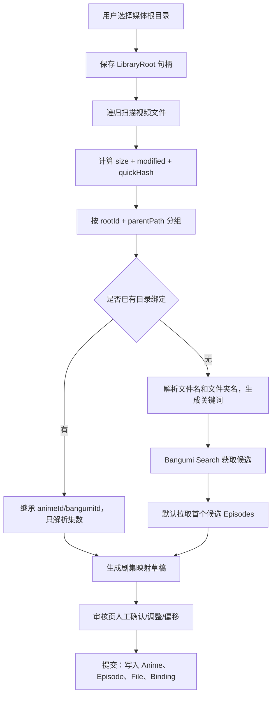
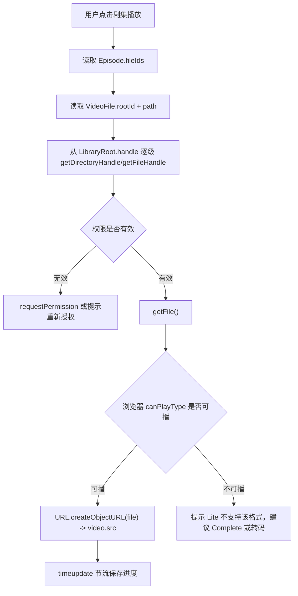
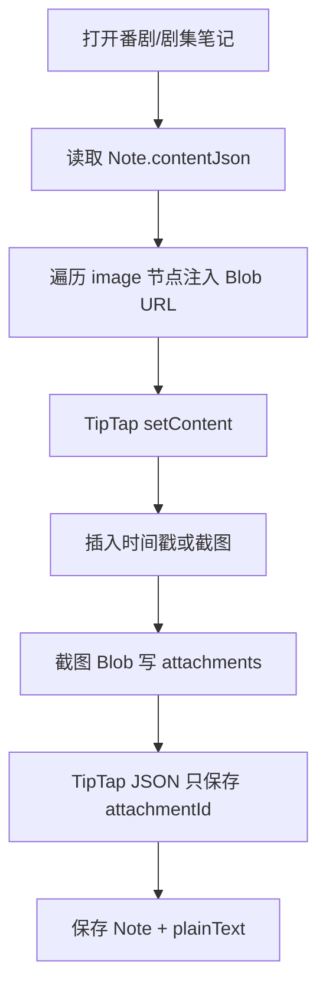

# Euphonium Lite V3 技术方案

> 目标：在 V2 文档的基础上，结合当前 `euphonium-lite` 代码结构，敲定一个能落地的 Lite 优先方案。Complete 版保留为后续服务端演进方向，但不影响 Lite 的数据模型和导入闭环。

---

## 1. 结论

V2 的方向总体合理：先做纯前端 Lite，本地目录授权、IndexedDB 持久化、Bangumi 元数据匹配、本地播放、笔记和导出，是最小可闭环路线。

但 V2 里有几处需要在 V3 中修正：

1. **Lite 不追求全格式播放**  
   Lite 可以扫描和管理 `.mkv`，但播放能力只承诺浏览器原生支持的格式和编码组合。MKV、H.265、ASS 内封字幕等问题放到 Complete 版用 FFmpeg/HLS 解决。

2. **本地实体主键使用 UUID，Bangumi ID 只作为外部 ID**  
   当前代码的 `Anime.id`、`Episode.id` 使用 UUID 是正确方向。不要用 `bgm_id` 作为本地主键，否则手动条目、未来多数据源、导入合并都会受限。

3. **文件表不保存每个文件的 FileHandle**  
   正确做法是只保存根目录 `FileSystemDirectoryHandle`，文件表保存 `rootId + relativePath + 文件指纹`。播放时从根目录句柄按相对路径逐级取回文件。

4. **匹配流程以“目录分组 + 人工审核”为可信边界**  
   文件名解析不可能 100% 准确。解析器只负责给出候选和置信度，最终以目录绑定和审核页确认结果为准。

5. **Bangumi 剧集映射必须同时存 `ep`、`sort`、`type`**  
   不能只按 `ep` 关联。特别篇、总集篇、连续季度、官方排序偏移都会让单字段匹配出错。

6. **Complete 版不进入 Lite MVP 的关键路径**  
   FastAPI、FFmpeg、Celery、超分辨率、Docker 都作为后续架构预留，不在 Lite 阶段提前引入复杂度。

---

## 2. 最终范围

### Lite V3 必做

| 模块 | 范围 |
| --- | --- |
| 本地目录授权 | 使用 File System Access API 授权一个或多个媒体根目录，并将根目录句柄存入 IndexedDB |
| 扫描与去重 | 递归扫描视频文件，计算快速指纹，识别新增、移动、缺失、重复文件 |
| 文件名解析 | 内置规则解析季、集、标题、范围集数、字幕组/画质噪音；支持用户自定义规则 |
| 目录绑定 | 以 `rootId + parentPath` 作为目录绑定键，同一目录后续文件继承已确认的番剧 |
| Bangumi 匹配 | Search API 获取条目候选；Episodes API 获取官方剧集；审核页确认番剧和剧集映射 |
| 番剧库 | 展示本地条目、封面、状态、评分、观看进度、文件缺失状态 |
| 播放 | 仅播放浏览器原生可播的本地文件；保存播放进度 |
| 笔记 | TipTap 富文本，支持时间戳、截图、附件 Blob、按番剧/剧集保存 |
| 导入导出 | 版本化 JSON 导出元数据；Zip 导出笔记附件；导入时做路径重映射和冲突处理 |

### Lite V3 不做

| 模块 | 原因 |
| --- | --- |
| 实时转码/HLS | 浏览器纯前端无法可靠完成，放到 Complete |
| H.265/MKV 全格式播放保证 | 取决于浏览器和系统解码能力，Lite 只提示不可播 |
| 离线超分辨率 | 算力、耗时、依赖复杂，放到服务端任务队列 |
| 多用户同步 | Lite 是本地单用户应用，数据同步留给 Complete |

### Complete 版预留

Complete 版沿用 Lite 的导出格式和领域模型，新增服务端能力：

- FastAPI 提供媒体库 API。
- SQLite/PostgreSQL 持久化。
- FFmpeg 提供 HLS 转封装/转码。
- Celery/RQ + Redis 处理离线超分辨率。
- Docker Compose 部署。
- Lite JSON 导入时通过挂载目录做路径重映射。

---

## 3. 技术栈锁定

### 当前保留

| 层 | 技术 |
| --- | --- |
| 前端框架 | Vue 3 + TypeScript + Vite |
| 路由 | Vue Router |
| 本地数据库 | Dexie.js / IndexedDB |
| 状态管理 | Pinia 或当前轻量 store，后续统一收敛到 Pinia |
| 图标 | lucide-vue-next |
| 浏览器文件系统 | File System Access API |
| 元数据源 | Bangumi v0 API |

### Lite 需要新增

| 能力 | 建议依赖 | 说明 |
| --- | --- | --- |
| 富文本笔记 | `@tiptap/vue-3`、`@tiptap/starter-kit`、`@tiptap/extension-image` | 截图、时间戳节点都基于 TipTap 扩展 |
| Zip 导出 | `fflate` 或 `jszip` | 附件和 JSON 打包 |
| 并发限制 | 自写小工具或 `p-limit` | 控制 Bangumi 请求和文件 hash 并发 |
| 日期工具 | 原生 `Date` 即可 | 暂不引入重型日期库 |

### Complete 才需要

| 能力 | 建议依赖 |
| --- | --- |
| HLS 播放 | `hls.js` |
| 服务端框架 | FastAPI |
| 服务端 ORM | SQLAlchemy |
| 转码 | FFmpeg |
| 任务队列 | Celery/RQ + Redis |
| 服务端解析 | GuessIt / anitomy |

---

## 4. 总体架构

Lite 版按领域拆成 8 个模块：

```text
UI Views
  ├─ ImportView      扫描、匹配、审核
  ├─ HomeView        番剧库
  ├─ TheatreView     播放、选集、进度
  └─ SettingsView    自定义规则、数据导入导出

Services
  ├─ fileSystem      授权、权限恢复、递归扫描、文件定位
  ├─ parser          文件名解析、目录名兜底、置信度
  ├─ matcher         目录分组、Bangumi 候选、剧集映射
  ├─ bangumi         API 请求、缓存、错误处理
  ├─ writer          审核结果提交到本地库
  ├─ playback        Object URL 生命周期、进度保存
  ├─ notes           TipTap JSON、附件、截图、时间戳
  └─ export          JSON/Zip 导入导出、版本迁移

Persistence
  └─ Dexie / IndexedDB
```

核心原则：

- UI 不直接写 Dexie，统一经过 service/API 层。
- 文件扫描、Bangumi 请求、写库提交分阶段执行，避免长事务。
- IndexedDB 事务只做本地读写，不在事务内等待网络请求。
- 所有导入数据带 `schemaVersion`，后续迁移可控。

---

## 5. 核心流程

### 5.1 首次导入流程



### 5.2 重扫流程

重扫不能简单清空文件表再写入。正确策略：

1. 只对本次扫描的 `rootId` 做 diff。
2. 文件身份使用 `size + quickHash` 识别同一文件。
3. `path` 变化但指纹相同，视为移动或重命名，保留原有 `episodeId`。
4. 本次未出现的文件先标记为 `missing`，不要立即删除。
5. 用户确认清理后，再真正删除文件记录并解除剧集关联。

### 5.3 匹配审核流程

审核页需要支持：

- 展示每个目录分组，而不是每个文件都单独匹配。
- 显示候选番剧列表，默认选择综合评分最高的候选。
- 切换候选时重新拉取该候选的 Episodes。
- 显示本地文件到官方剧集的映射草稿。
- 支持批量偏移，例如 `+12`、`-1`。
- 支持拖拽或下拉手动指定单个文件对应剧集。
- 支持“此目录以后绑定到该番剧”。
- 支持“跳过此目录”或“作为本地条目导入”。

提交审核结果后才写入正式番剧库。审核前的内容只存在 `matchSessions` / `matchGroups` 里。

### 5.4 播放流程



注意：

- 切换剧集或页面销毁时必须 `URL.revokeObjectURL`。
- 播放进度保存需要节流，例如每 5 秒或暂停/退出时保存。
- 同一剧集多个文件时，优先播放用户上次选择的文件。

### 5.5 笔记流程



时间戳节点保存秒数，不只保存显示文本：

```ts
interface TimestampNodeAttrs {
  seconds: number
  label: string // 例如 "[01:25]"
  episodeId?: string
}
```

截图节点保存附件 ID：

```ts
interface ImageNodeAttrs {
  attachmentId: string
  alt?: string
  width?: number
  height?: number
}
```

---

## 6. 文件名解析与匹配策略

### 6.1 解析器输出

解析器不要只返回 `{ title, season, episode }`，需要返回更多上下文：

```ts
interface ParsedVideoName {
  rawName: string
  cleanName: string
  titleCandidates: string[]
  episode?: number
  episodeEnd?: number
  season?: number
  subtitleGroup?: string
  resolution?: string
  source?: string
  codec?: string
  confidence: number
  warnings: ParserWarning[]
}

type ParserWarning =
  | 'NO_EPISODE'
  | 'NO_TITLE'
  | 'RANGE_EPISODE'
  | 'LOW_CONFIDENCE'
  | 'SPECIAL_EPISODE'
```

### 6.2 规则顺序

建议顺序：

1. 去扩展名。
2. 提取开头字幕组，例如 `[Lilith-Raws]`。
3. 提取季集模式：`S02E03`、`Season 2 - 03`。
4. 提取明确中文集数：`第 03 话`、`03话`。
5. 提取 `EP03`、`E03`。
6. 提取范围：`01-02`、`01~02`，标记 `RANGE_EPISODE`。
7. 清理画质、编码、来源、音轨等噪音。
8. 若 title 为空，用上级文件夹名作为第一标题候选。

当前 `src/utils/fileNameParser.ts` 的问题是普通数字规则排在 `SxxExx` 之前，容易把 `S02E03` 里的 `02` 当成集数。V3 实现时需要先匹配结构化季集模式。

### 6.3 目录分组

导入匹配的基本单位是目录：

```ts
interface FolderGroup {
  folderKey: string // `${rootId}:${parentPath}`
  rootId: string
  parentPath: string
  folderName: string
  files: VideoFile[]
  parsedItems: ParsedVideoName[]
  keywordCandidates: string[]
}
```

关键词优先级：

1. 已存在的 `seriesBindings.folderKey`。
2. 用户自定义目录规则。
3. 上级文件夹名。
4. 文件名解析出的最高频 title。
5. 用户手动输入。

### 6.4 Bangumi 条目候选评分

Search API 返回候选后，本地做二次评分，避免盲目使用第一条：

```ts
interface SubjectCandidateScore {
  bangumiId: number
  score: number
  reasons: string[]
}
```

评分建议：

| 条件 | 分值 |
| --- | --- |
| `name_cn` 或 `name` 与目录名完全相等 | +50 |
| 包含关系或规范化后相等 | +30 |
| 首播年份与目录/文件名年份一致 | +15 |
| 集数数量与本地集数数量接近 | +10 |
| Bangumi 排名/评分较高 | +0 到 +5 |
| 候选类型不是动画 | 直接排除 |

最终仍需要审核页确认，评分只决定默认选项。

### 6.5 剧集映射

官方剧集表必须保存：

- `bangumiEpisodeId`
- `ep`
- `sort`
- `type`
- `name`
- `nameCn`
- `airdate`

映射顺序：

1. 只对 `type === 0` 的正片做默认自动映射。
2. 本地集数同时尝试匹配官方 `sort` 和 `ep`。
3. 如果整体没有命中，计算偏移：`offset = minOfficialSort - minLocalEpisode`。
4. 偏移后再次匹配。
5. 特别篇、OVA、SP 文件进入人工确认区，不自动硬绑。
6. 范围集数文件只绑定到起始集，或在 UI 中让用户选择多集关联。

---

## 7. 数据结构

### 7.1 LibraryRoot

```ts
interface LibraryRoot {
  id: string
  name: string
  handle: FileSystemDirectoryHandle
  createdAt: number
  updatedAt: number
  lastGrantedAt?: number
  lastScannedAt?: number
}
```

### 7.2 VideoFile

```ts
interface VideoFile {
  id: string
  rootId: string
  name: string
  path: string
  parentPath: string
  ext: string
  size: number
  modified: number
  quickHash: string
  fullHash?: string
  animeId?: string
  episodeId?: string
  scanState: 'active' | 'missing' | 'ignored'
  lastSeenAt: number
  createdAt: number
  updatedAt: number
}
```

说明：

- `path` 是相对授权根目录的路径，不能存绝对路径作为唯一定位依据。
- `quickHash` 用于快速识别移动/重复文件。
- `fullHash` 可选，只在用户触发深度校验时计算。
- 文件缺失先标记 `missing`，避免重扫误删用户关联。

### 7.3 Anime

```ts
type AnimeStatus = 'watching' | 'planned' | 'completed' | 'on_hold' | 'dropped'

interface Anime {
  id: string
  bangumiId?: number
  title: string
  titleCn?: string
  originalTitle?: string
  aliases: string[]
  cover?: string
  summary?: string
  airDate?: string
  airYear?: number
  totalEpisodes?: number
  bangumiScore?: number
  rating: number
  status: AnimeStatus
  tags: string[]
  source: 'bangumi' | 'manual'
  createdAt: number
  updatedAt: number
}
```

### 7.4 Episode

```ts
interface Episode {
  id: string
  animeId: string
  bangumiEpisodeId?: number
  ep?: number
  sort?: number
  type: 0 | 1 | 2 | 3 | 4 | 5 | 6
  title?: string
  titleCn?: string
  airdate?: string
  durationSeconds?: number
  desc?: string
  fileIds: string[]
  watched: boolean
  watchedAt?: number
  rating: number
  progressSeconds?: number
  durationLocalSeconds?: number
  createdAt: number
  updatedAt: number
}
```

### 7.5 SeriesBinding

```ts
interface SeriesBinding {
  folderKey: string
  rootId: string
  parentPath: string
  folderName: string
  animeId: string
  bangumiId?: number
  season?: number
  parserPresetId?: string
  createdAt: number
  updatedAt: number
}
```

### 7.6 MatchSession / MatchGroup

```ts
interface MatchSession {
  id: string
  rootId: string
  status: 'scanning' | 'matching' | 'reviewing' | 'committed' | 'failed'
  summary: {
    scanned: number
    added: number
    updated: number
    missing: number
    groups: number
  }
  createdAt: number
  updatedAt: number
}

interface MatchGroup {
  id: string
  sessionId: string
  folderKey: string
  keyword: string
  status: 'idle' | 'candidate_loaded' | 'selected' | 'mapped' | 'skipped' | 'committed'
  candidateBangumiIds: number[]
  selectedBangumiId?: number
  selectedAnimeId?: string
  draftMappings: DraftEpisodeMapping[]
  offset?: number
  warnings: string[]
  createdAt: number
  updatedAt: number
}

interface DraftEpisodeMapping {
  localEpisode?: number
  fileIds: string[]
  targetEpisodeId?: string
  targetBangumiEpisodeId?: number
  confidence: number
  source: 'direct' | 'offset' | 'manual' | 'binding'
}
```

### 7.7 Notes / Attachments

```ts
interface Note {
  id: string
  animeId: string
  episodeId?: string
  contentJson: unknown
  plainText: string
  attachmentIds: string[]
  createdAt: number
  updatedAt: number
}

interface Attachment {
  id: string
  noteId?: string
  mimeType: string
  blob: Blob
  width?: number
  height?: number
  createdAt: number
}
```

### 7.8 ApiCache

```ts
interface ApiCache<T = unknown> {
  key: string
  value: T
  expiresAt: number
  createdAt: number
}
```

缓存键示例：

- `search:subject:${normalizedKeyword}`
- `subject:${bangumiId}`
- `episodes:${bangumiId}`

---

## 8. Dexie Schema 建议

下一版数据库建议使用 `version(2)` 或更高版本迁移：

```ts
this.version(2).stores({
  libraryRoots: 'id, name, updatedAt, lastScannedAt',
  files: 'id, rootId, path, parentPath, quickHash, [rootId+path], [size+quickHash], animeId, episodeId, scanState, lastSeenAt',
  anime: 'id, &bangumiId, title, titleCn, airYear, status, rating, updatedAt',
  episodes: 'id, animeId, &bangumiEpisodeId, [animeId+sort], [animeId+ep], watched, updatedAt',
  seriesBindings: '&folderKey, rootId, parentPath, animeId, bangumiId, updatedAt',
  matchSessions: 'id, rootId, status, createdAt, updatedAt',
  matchGroups: 'id, sessionId, folderKey, status, selectedBangumiId, updatedAt',
  notes: 'id, animeId, episodeId, updatedAt',
  attachments: 'id, noteId, mimeType, createdAt',
  watchHistory: 'id, animeId, episodeId, watchedAt',
  apiCache: 'key, expiresAt',
  settings: 'key',
})
```

注意：

- `&bangumiId` 只适合非空唯一值。若 Dexie 对可选唯一索引处理不符合预期，需要改为普通索引并在代码层保证唯一。
- `libraryRoots.handle` 是结构化克隆对象，必须实际验证当前浏览器能写入 IndexedDB。
- 当前 `db.ts` 已声明 `dirHandle` store，但 class 上没有类型字段，V3 迁移时应补齐或替换为 `libraryRoots`。

---

## 9. API 策略

### 9.1 Bangumi 请求

Lite 使用这些接口：

- `POST https://api.bgm.tv/v0/search/subjects?limit=5`
- `GET https://api.bgm.tv/v0/subjects/{subject_id}`
- `GET https://api.bgm.tv/v0/episodes?subject_id={subject_id}`

请求策略：

- Search 并发限制为 2 到 4。
- 同一关键词本地缓存，避免重复请求。
- Episodes 按 `subject_id` 缓存。
- 搜索失败时保留审核项，不阻断整个导入。
- 无候选时允许用户手动输入 Bangumi ID。

### 9.2 User Agent

浏览器环境不能可靠自定义 `User-Agent`，Lite 直接浏览器请求即可。Complete 版作为非浏览器服务端客户端时，必须按 Bangumi 建议设置带开发者标识和应用名的 User Agent。

### 9.3 API 类型映射

需要修正当前 `BangumiEpisode` 类型，补齐字段：

```ts
interface BangumiEpisode {
  id: number
  subject_id: number
  sort: number
  ep: number
  type: 0 | 1 | 2 | 3 | 4 | 5 | 6
  name: string
  name_cn: string
  airdate: string
  duration_seconds?: number
  desc?: string
}
```

---

## 10. 技术难点与处理方式

| 难点 | 最终处理 |
| --- | --- |
| 浏览器文件权限会失效 | 每次播放或重扫前 `queryPermission`，必要时 `requestPermission`；失败时提示重新授权 |
| 非 Chromium 浏览器不支持 File System Access API | Lite 主支持 Chrome/Edge；设置页显示兼容性说明；可选降级为 `webkitdirectory` 一次性扫描但不保证持久播放 |
| 文件名不规范 | 自定义解析器只做候选；目录绑定和审核结果才是最终真相 |
| 同一文件移动/改名 | 用 `size + quickHash` 识别，保留剧集关联并更新 path |
| 重扫误删 | 标记 `missing`，不立即删除 |
| Bangumi 搜索不稳定 | 本地候选评分 + 缓存 + 手动 Bangumi ID |
| `ep` 和 `sort` 冲突 | 官方剧集表同时保存两者；默认只自动映射正片 `type=0` |
| MKV/H.265 播放失败 | Lite 显示不可播原因；Complete 用 FFmpeg/HLS |
| 截图污染画布 | Lite 本地 Object URL 不跨域；Complete HLS 必须配置 CORS 并设置 `crossOrigin="anonymous"` |
| 附件占用 IndexedDB 空间 | 使用 JPEG/WebP 压缩，显示存储占用，导出后可清理附件 |
| 数据迁移 | JSON 导出带 `schemaVersion`，导入时按版本迁移 |

---

## 11. 当前代码落地差异与改造点

以下是从当前代码出发需要优先修正的地方：

1. `ImportView.vue` 目前主要使用 `mockStore` 和 `webkitdirectory`，应改为调用 `requestDirectory()`、`scanVideos()`、`createMatch()` 等真实服务。

2. `src/db/db.ts` 里有 `dirHandle` store，但 `EuphoniumDB` class 没声明对应 table。V3 建议替换为 `libraryRoots`。

3. `src/utils/fileNameParser.ts` 的普通数字规则优先级过高，会误判 `S02E03`。需要改成结构化规则优先，并返回置信度与 warnings。

4. `src/services/match.ts` 的 `mappingMatch` 判断条件不对：已选择番剧后反而会 return。应改为未选择时阻止 mapping。

5. 当前 `MatchRecord` 以 `keyword` 为主键，缺少 `folderKey`。V3 要以目录分组为基本审核单位。

6. 当前 `BangumiEpisode` 类型缺少 `sort` 和 `type`，`dataWriter.ts` 只按 `ep` 映射，会造成偏移和特别篇错误。

7. 当前文件删除逻辑会删除本次未出现的文件。多根目录和临时权限失败场景下，应先标记 `missing`。

8. 当前播放页是 mock UI，还没有从 `Episode.fileIds` 定位真实本地文件。需要新增 playback service。

9. 当前 `Anime.overall_notes`、`Episode.notes` 是字符串字段，不足以承载 TipTap JSON、附件和全文检索。应独立出 `notes` 与 `attachments` 表。

---

## 12. 分阶段实施计划

### 阶段 1：导入闭环

目标：真实扫描、真实匹配、真实写库。

- 迁移 Dexie schema。
- 重写 parser 输出结构。
- 支持 `libraryRoots` 和权限恢复。
- 扫描文件并按目录分组。
- 接入 Bangumi Search、Subject、Episodes 缓存。
- 审核页展示候选与映射。
- 提交审核结果写入 Anime/Episode/File/Binding。

验收：

- 选择一个包含多部番剧的根目录，能按目录分组。
- 同一目录只搜索一次 Bangumi。
- 用户确认后，首页能看到真实导入的番剧。

### 阶段 2：播放与进度

目标：从本地文件真实播放。

- 根据 `rootId + path` 取回 File。
- 检测 MIME/扩展名和 `canPlayType`。
- Object URL 生命周期管理。
- 保存剧集播放进度、已看状态、最近观看。
- 多文件剧集选择。

验收：

- MP4/WebM 能播放并恢复进度。
- 不可播 MKV 有明确提示，不导致页面崩溃。

### 阶段 3：笔记与附件

目标：完成核心差异化能力。

- 引入 TipTap。
- 实现时间戳节点。
- 实现视频截图到附件表。
- 保存 TipTap JSON 和 plain text。
- 导出 Markdown + 图片附件 Zip。

验收：

- 笔记重开后图片和时间戳可用。
- 点击时间戳能跳转当前剧集播放时间。

### 阶段 4：数据导入导出

目标：为迁移和 Complete 版打基础。

- JSON schema version。
- 导出 Anime、Episode、File、Binding、Note 元数据。
- Zip 打包附件。
- 导入时支持路径重映射。
- 冲突策略：跳过、覆盖、合并。

验收：

- 清库后可从导出文件恢复番剧、笔记、附件。
- 换目录后可通过重映射恢复文件关联。

### 阶段 5：Complete 版

目标：服务端媒体库。

- FastAPI + SQLite。
- 服务端扫库。
- FFmpeg HLS 播放。
- Lite JSON 导入。
- Docker Compose。
- 后续再做 Anime4K/Real-CUGAN。

---

## 13. 注意事项

1. 不要在 IndexedDB 事务里做 fetch、hash 大文件、递归扫描等长耗时任务。
2. 不要把绝对路径作为核心数据模型，浏览器无法长期可靠访问绝对路径。
3. 不要在未审核时把候选结果写入正式番剧库。
4. 不要默认删除缺失文件，先进入 `missing` 状态。
5. 不要假设 `ep === sort`。
6. 不要承诺 Lite 播放 MKV/H.265。
7. 不要把 Blob URL 存进数据库，只存附件 ID。
8. 不要把用户自定义正则直接无保护执行在大量文件上，需要 try/catch 和超时/回退策略。
9. 导入导出必须带版本号，否则后续 Complete 迁移成本会很高。
10. Bangumi API 失败时应允许用户继续手动导入，不要让整个扫描流程失败。

---

## 14. 最终推荐方案

最终方案定为：

**Euphonium Lite V3 = Vue3 + Dexie + File System Access API + 自定义可配置解析器 + 目录绑定 + Bangumi 审核式匹配 + 原生本地播放 + TipTap 笔记 + 版本化导入导出。**

架构上坚持 Lite 优先：

- 扫描和匹配做到可靠。
- 播放能力诚实受限。
- 笔记和数据可迁移做扎实。
- Complete 只消费 Lite 产出的导出格式，不反向绑死 Lite。

这样可以最快得到一个真正可用的本地番剧库，同时为后续服务端、HLS、超分辨率留下清晰扩展点。

---

## 参考

- Bangumi API 官方仓库：https://github.com/bangumi/api
- Bangumi API User Agent 建议：https://github.com/bangumi/api/blob/master/docs-raw/user%20agent.md
- Bangumi v0 OpenAPI：https://bangumi.github.io/api/
